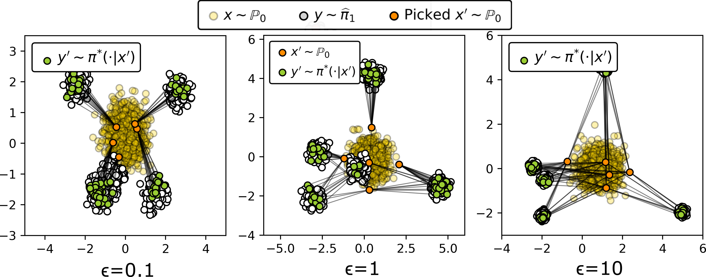

# Continuous Entropic OT (Schrodinger Bridge) Benchmark

This is the official Python implementation of the NeurIPS 2023 paper *Building the Bridge of Schrödinger:
A Continuous Entropic Optimal Transport Benchmark* ([https://arxiv.org/abs/2306.10161](https://arxiv.org/abs/2306.10161)) by [Nikita Gushchin](https://scholar.google.com/citations?user=UaRTbNoAAAAJ), [Alexander Kolesov](https://scholar.google.com/citations?user=WyAI_wUAAAAJ), [Petr Mokrov](https://scholar.google.com/citations?user=CRsi4IkAAAAJ&hl=en), [Polina Karpikova](https://scholar.google.com/citations?user=2o1dSLkAAAAJ), Andrey Spiridonov, [Evgeny Burnaev](https://scholar.google.com/citations?user=pCRdcOwAAAAJ), [Alexander Korotin](https://scholar.google.com/citations?user=1rIIvjAAAAAJ).

The repository contains a set of continuous benchmark distributions for testing EOT/SB solvers for the quadratic cost.

<p align="center"></p>

## Citation

If you find this repository or the ideas presented in our paper useful, please consider citing our paper.

```
@inproceedings{gushchin2023building,
  title={Building the Bridge of Schr$\backslash$" odinger: A Continuous Entropic Optimal Transport Benchmark},
  author={Gushchin, Nikita and Kolesov, Alexander and Mokrov, Petr and Karpikova, Polina and Spiridonov, Andrey and Burnaev, Evgeny and Korotin, Alexander},
  booktitle={Thirty-seventh Conference on Neural Information Processing Systems Datasets and Benchmarks Track},
  year={2023}
}
```

## Pre-requisites
```console
pip install -r requirements.txt
python setup.py install
```

## Repository structure
We provide several notebooks illustrating the usage of our benchmark.
- `notebooks/mixtures_benchmark_visualization_eot.ipynb` -- visualizing images benchmark pairs, metrics computation example;
- `notebooks/mixtures_benchmark_visualization_sb.ipynb` -- visualizing trajectories of the optimal process, metrics computation example;
- `notebooks/images_benchmark_visualization.ipynb` -- visualizing images benchmark pairs;
- `notebooks/images_langevin_sampling.ipynb` -- obtaining denoised sample from noised counterparts;

And we also provide notebooks to quickly plot some images from the paper.
- `notebooks/plot_mixtures_results_eot.ipynb` -- plotting the qualitative results (PCA projections) of EOT methods on our mixtures benchmark;
- `notebooks/plot_mixtures_results_sb.ipynb` -- plotting the quantitative results (KL/RKL) of SB methods on our mixtures pairs;
- `benchmark_construction_examples` -- several examples of how to construct benchmark pairs from data.

## Loading Benchmark Pairs For Mixtures
```python
from eot_benchmark.gaussian_mixture_benchmark import (
    get_guassian_mixture_benchmark_sampler,
    get_guassian_mixture_benchmark_ground_truth_sampler, 
    get_test_input_samples,
)

DIM = 16  # 2,16,64,128
EPS =  0.1 # 0.1, 1, 10
BATCH_SIZE = 1024
GPU_DEVICE = 0

input_sampler = get_guassian_mixture_benchmark_sampler(input_or_target="input", dim=DIM, eps=EPS,
                                          batch_size=BATCH_SIZE, device=f"cuda:{GPU_DEVICE}", download=True)

target_sampler = get_guassian_mixture_benchmark_sampler(input_or_target="target", dim=DIM, eps=EPS,
                                          batch_size=BATCH_SIZE, device=f"cuda:{GPU_DEVICE}", download=True)

ground_truth_plan_sampler = get_guassian_mixture_benchmark_ground_truth_sampler(dim=DIM,eps=EPS,
                                                          batch_size=BATCH_SIZE , device=f"cuda:{GPU_DEVICE}",
                                                                                download=True)
```

<p align="center"></p>

## Loading Benchmark Pairs For Images
```python
import torch
from matplotlib import pyplot as plt
from eot_benchmark.image_benchmark import ImageBenchmark

EPS = 0.1
GPU_DEVICE = 0

benchmark = ImageBenchmark(batch_size=20, eps=EPS, glow_device=f"cuda:{GPU_DEVICE}",
                           samples_device=f"cuda:{GPU_DEVICE}", download=False)

X_sampler = benchmark.X_sampler
Y_sampler = benchmark.Y_sampler
GT_sampler = benchmark.GT_sampler
```

<p align="center"></p>

Test image datasets (for cFID, sets of "y" and 5k "x" per each "y") are available via the [following link](https://disk.yandex.ru/d/iylrmxv5kHzQMQ). These are int8 tensors, use torch.load. To get the test set for standard FID, use the built-in function which automatically downloads the test set.

```python
X_test_sampler = benchmark.X_test_sampler
Y_test_sampler = benchmark.Y_test_sampler
```

## Credits
- [Weights & Biases](https://wandb.ai) developer tools for machine learning;
- [CelebA page](http://mmlab.ie.cuhk.edu.hk/projects/CelebA.html) with faces dataset and [this page](https://www.kaggle.com/jessicali9530/celeba-dataset) with its aligned 64x64 version;
- [pytorch-fid repo](https://github.com/mseitzer/pytorch-fid) to compute [FID](https://arxiv.org/abs/1706.08500) score;

